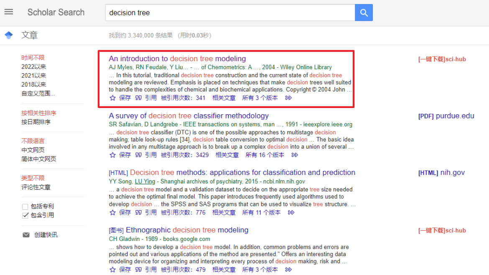
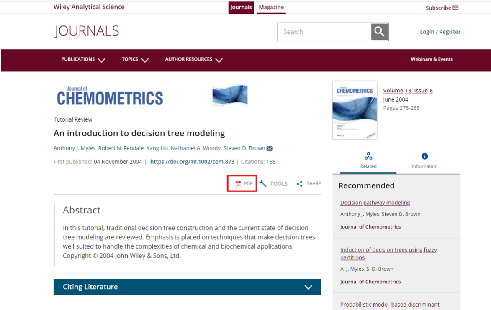
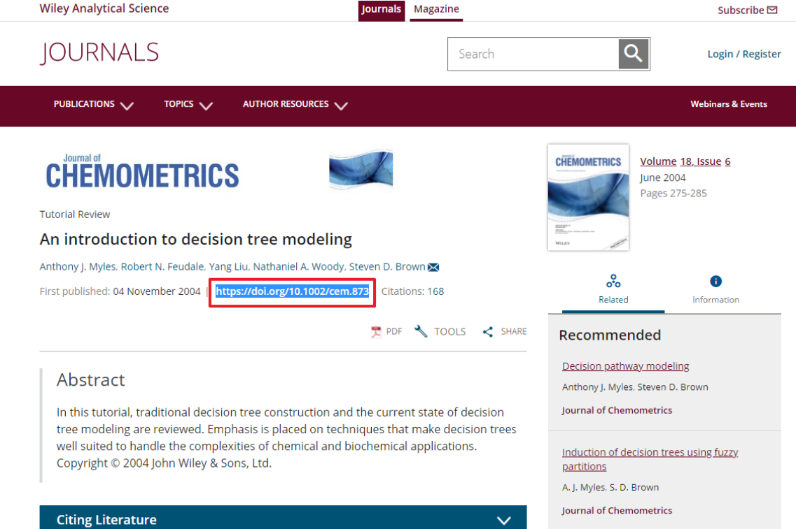
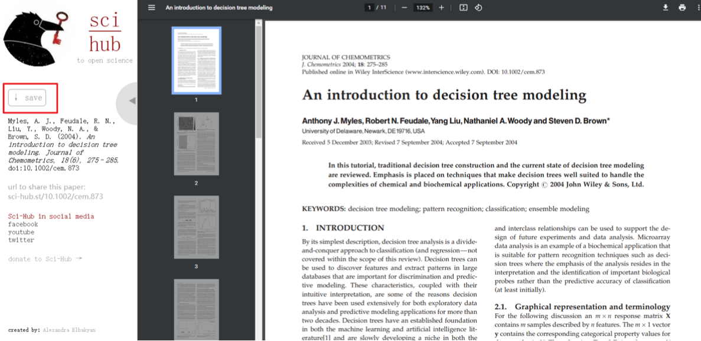

## 外国文献 查阅+下载+翻译

1. 在这个网站里面选择一个谷歌学术镜像访问：https://ac.scmor.com/

2. 成功进入到谷歌学术界面就可以查文献了：

3. 比如我搜索 decision tree 相关的文献：

   我想下载第一个文献，点进去，在详情页面找类似于 **“下载”、“PDF”** 之类的字眼：

   试下可不可以下载，如果可以直接下载就OK

4. 如果要注册或者要钱的话，复制这篇论文的 **DOI** 号：

   打开这个网站：https://sci-hub.st/，搜索这个 DOI

   然后就可以下载了：

5. 用这个网站可以翻译英文文献：https://fanyipdf.com/

